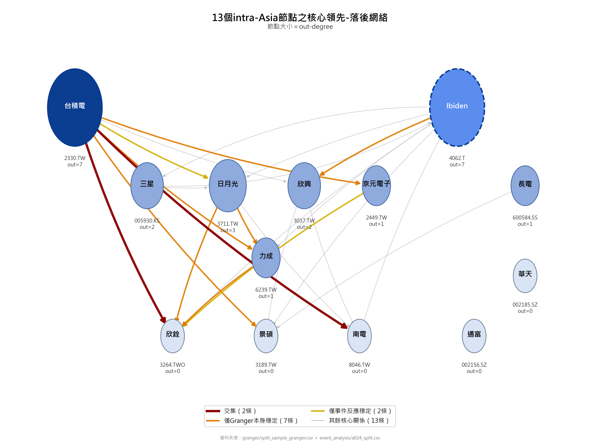
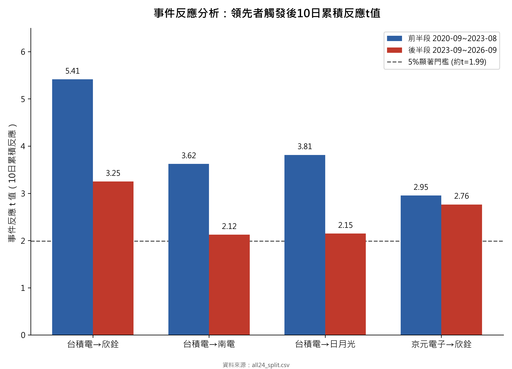

# 先進封裝供應鏈跨市場領先-落後關係研究

本repo收錄了先進封裝(advanced packaging)供應鏈15家核心公司之間跨市場股價領先-落後關係的完整研究——18支Python腳本,從Yahoo Finance原始股價開始,一路重建所有中間資料跟最終分析結果,並附上兩張定案圖表,任何人都能照著跑出一樣的結果。

## 研究問題

先進封裝供應鏈涵蓋晶圓代工、基板、封裝測試等環節,橫跨台灣、美國、日本、南韓、中國多個市場。本研究以Granger因果檢定為核心,搭配安慰劑檢定、網絡中心性、Transfer Entropy、事件反應分析等方法交叉驗證,檢視供應鏈上下游公司之間,股價報酬是否存在統計上顯著、且方向與供應鏈實際結構一致的領先-落後關係。

## 方法概要

- **資料**:15檔核心供應鏈公司2020-09至2026-09的日調整後收盤價(對數報酬率),另含3檔中國A股的未調整OHLCV(供漲跌停判定用)。
- **核心分析**:210組全配對Granger因果檢定(BIC/AIC選lag、Newey-West HAC穩健F檢定、BH-FDR多重比較校正),篩出13家亞洲公司間24條顯著關係邊。
- **穩健性驗證**:
  - 時區對齊安慰劑檢定(headline vs 反向 vs naive三種美股-亞股對齊方式)
  - 前後兩段(以2023-09-01切分)分段複驗,分類關係是否全期間穩定
  - Transfer Entropy(1,000次shuffle虛無分布)與Granger方向的一致性比對
  - 供應鏈實際層級方向(晶圓代工→基板→封裝測試)與統計方向的對齊檢驗
- **應用分析**:事件觸發反應分析(24條邊、pooled與分段)、一籃子回測(19條邊,vs隨機持有窗口與buy-and-hold)、RS/動能/RRG技術指標交叉驗證。

完整方法論細節與逐步驗證邏輯見 [REPRODUCE.md](REPRODUCE.md)。

## 核心發現

24條核心邊分別以Granger因果檢定與事件反應分析,各自獨立做「以2023-09-01切分前後兩段,是否兩段皆顯著」的分段穩健性複驗。兩種方法判定為全期間穩定的結果並不完全重疊:

- **Granger因果檢定判定全期間穩定:9條**(前後兩段FDR校正後皆顯著)
- **事件反應分析判定全期間穩定:4條**(前後兩段觸發後累積報酬t檢定皆顯著)
- **兩者交集(兩種方法皆判定全期間穩定):2條** — 台積電→欣銓、台積電→南電
- **僅Granger因果檢定判定全期間穩定(事件反應分段未達顯著):7條**
- **僅事件反應分析判定全期間穩定(Granger分段未達顯著):2條** — 台積電→日月光、京元電子→欣銓

詳細逐邊分類見 `data/results/granger/split_sample_granger.csv` 與 `data/results/event_analysis/all24_split.csv`。

## 主要圖表

| | |
|---|---|
|  |  |
| `fig1_network.png` — 供應鏈因果網絡圖 | `fig2_event_bars.png` — 事件反應長條圖 |

## 資料夾結構

```
data/
  raw/          腳本01抓取的原始股價
  processed/    腳本02-04的清理、對齊、報酬率計算中間產出
  results/      腳本05-16的最終分析結果,分granger/placebo/network/technical/event_analysis五個子資料夾
  results/figures/  產出圖表(腳本17-18繪製)
scripts/
  01-16         資料抓取→清理→核心分析→穩健性驗證→應用分析,依序執行即可重建全部結果
  17-18         繪製data/results/figures/底下的兩張圖表
REPRODUCE.md    逐腳本輸入輸出說明、資料衍生鏈、已驗證的重跑結果比對
requirements.txt
```

各資料子資料夾底下另有README.md,逐欄位說明每個輸出檔案的內容。

## 如何重現

```bash
pip install -r requirements.txt
python scripts/01_fetch_data.py   # 連網,從Yahoo Finance抓取
python scripts/02_clean_align.py
...                                # 依編號02-16依序執行
python scripts/17_plot_network.py
python scripts/18_plot_event_bars.py
```

腳本01、10需連網存取Yahoo Finance,其餘全部離線運算。詳細執行順序、資料依賴關係與已知的重跑差異(調整後股價會隨除權息追溯修正,屬預期現象)見 [REPRODUCE.md](REPRODUCE.md)。

## 環境需求

- Python 3.12(開發時用3.12.4)
- 套件版本見 [requirements.txt](requirements.txt)
